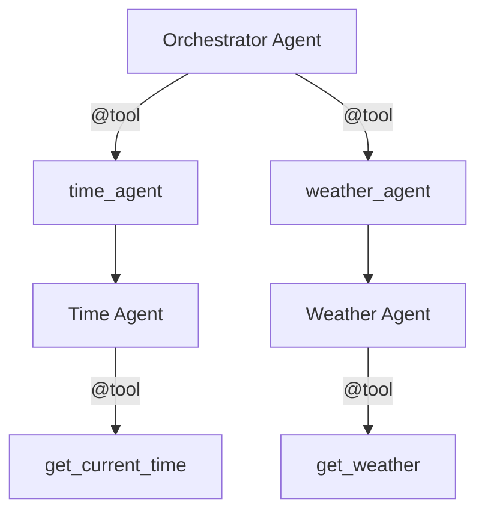

# Agent Architecture

This document describes how the multi-agent system is structured, how agents communicate, and how to extend it.

## Overview

The system uses the [Strands Agents SDK](https://github.com/strands-agents/sdk-python) to build a hierarchy of agents. Every agent is an instance of `strands.Agent` configured with a model, a system prompt, and a set of tools.

The key pattern is **agents-as-tools**: specialist agents are wrapped with the `@tool` decorator so the orchestrator can call them just like any other tool. This gives the orchestrator full control over when and how to delegate.

## Agent Hierarchy



### Orchestrator (`agents/orchestrator.py`)

The top-level agent. It receives the user query, decides which specialist(s) to invoke, and synthesizes a final answer.

- **Model**: configured via `agents/config.py`
- **Tools**: `time_agent`, `weather_agent`
- **Behaviour**: the system prompt instructs it to delegate rather than answer directly, and to combine results when a query spans multiple topics.

### Specialist Agents (`agents/specialists/`)

Each specialist is a function decorated with `@tool`. Inside the function, a new `Agent` is created, invoked with the query, and the result is returned as a string.

This pattern means:
- The orchestrator sees each specialist as a callable tool with a docstring.
- The LLM uses the docstring to decide when to call each specialist.
- Each specialist has its own system prompt and isolated tool set.

Example (`time_agent.py`):

```python
from strands import Agent, tool
from agents.config import get_model
from agents.tools import get_current_time

@tool
def time_agent(query: str) -> str:
    """A specialist agent that answers questions about the current date and time.
    Delegate any time-related questions to this agent."""
    agent = Agent(
        model=get_model(),
        system_prompt="You are a time specialist. Answer questions about the current date and time concisely.",
        tools=[get_current_time],
    )
    return str(agent(query))
```

### Tools (`agents/tools/`)

Leaf-level tools that perform actual work. Each is a plain Python function decorated with `@tool`. The Strands SDK uses the function signature and docstring to generate the tool schema that gets sent to the model.

- `get_current_time()` — returns the current UTC datetime.
- `get_weather(location: str)` — returns mock weather data for a location.

## Model Configuration (`agents/config.py`)

The `get_model()` function returns the model instance used by all agents. Two providers are supported:

| Provider | Auth | Config |
|----------|------|--------|
| **Amazon Bedrock** (default) | IAM role — no API key | `BEDROCK_MODEL_ID` env var |
| **Anthropic direct** | `ANTHROPIC_API_KEY` env var | `ANTHROPIC_MODEL_ID` env var |

Switch providers by uncommenting the relevant section in `config.py`.

## Request Flow

1. API Gateway sends a JSON event to the Lambda handler.
2. `lambda_handler.handler` extracts the `query` field and creates the orchestrator.
3. The orchestrator agent processes the query. The LLM decides which specialist tool(s) to call.
4. Each specialist creates its own agent, which in turn calls its leaf tools.
5. Results bubble back up: tool -> specialist agent -> orchestrator -> Lambda response.

## Adding a New Specialist

### 1. Create the tool

Add a file in `agents/tools/`, e.g. `agents/tools/translate.py`:

```python
from strands import tool

@tool
def translate_text(text: str, target_language: str) -> str:
    """Translates text to the target language."""
    # your implementation here
    return translated
```

Export it from `agents/tools/__init__.py`:

```python
from .translate import translate_text
```

### 2. Create the specialist agent

Add a file in `agents/specialists/`, e.g. `agents/specialists/translate_agent.py`:

```python
from strands import Agent, tool
from agents.config import get_model
from agents.tools import translate_text

@tool
def translate_agent(query: str) -> str:
    """A specialist agent that translates text between languages.
    Delegate any translation requests to this agent."""
    agent = Agent(
        model=get_model(),
        system_prompt="You are a translation specialist. Translate text accurately and concisely.",
        tools=[translate_text],
    )
    return str(agent(query))
```

Export it from `agents/specialists/__init__.py`:

```python
from .translate_agent import translate_agent
```

### 3. Register with the orchestrator

In `agents/orchestrator.py`, add the new specialist to the imports and tools list:

```python
from agents.specialists import time_agent, weather_agent, translate_agent

tools=[time_agent, weather_agent, translate_agent],
```

Update the system prompt to mention the new specialist so the orchestrator knows when to use it.

## Design Decisions

- **Agents-as-tools**: wrapping agents with `@tool` keeps the orchestrator's interface uniform — it doesn't need to know whether a tool is a simple function or a full agent.
- **Fresh agent per call**: specialist agents are instantiated on every invocation. This keeps them stateless and avoids context bleed between requests.
- **Single model config**: all agents share the same `get_model()` call, making it easy to swap providers globally. Override this per-agent if needed.
