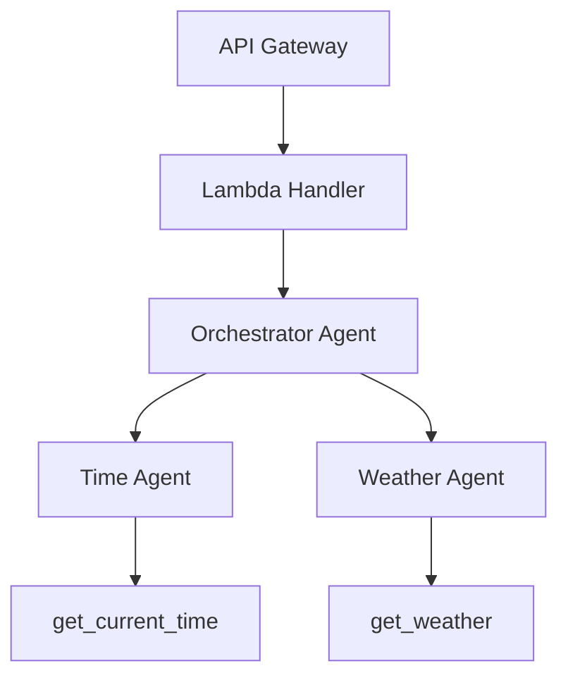

# AWS Agentic Boilerplate

A boilerplate for deploying multi-agent systems on AWS Lambda using the [Strands Agents SDK](https://github.com/strands-agents/sdk-python).

The project implements an **orchestrator pattern**: a top-level agent receives user queries and delegates work to specialist agents, each equipped with their own tools. The whole stack runs as a single Lambda function behind API Gateway.

## Architecture



- **Orchestrator** — routes incoming queries to the right specialist(s) and combines their responses.
- **Time Agent** — answers date/time questions using the `get_current_time` tool.
- **Weather Agent** — answers weather questions using the `get_weather` tool (mock data).

## Project Structure

```
.
├── lambda_handler.py          # Lambda entry point
├── agents/
│   ├── __init__.py            # Exports create_orchestrator
│   ├── config.py              # Model provider config (Bedrock / Anthropic)
│   ├── orchestrator.py        # Orchestrator agent
│   ├── specialists/
│   │   ├── __init__.py
│   │   ├── time_agent.py      # Time specialist agent
│   │   └── weather_agent.py   # Weather specialist agent
│   └── tools/
│       ├── __init__.py
│       ├── time.py            # get_current_time tool
│       └── weather.py         # get_weather tool
├── Dockerfile                 # Lambda container image
├── requirements.txt           # Python dependencies
└── .env.example               # Environment variable template
```

## Prerequisites

- Python 3.13+
- An AWS account with Bedrock model access enabled (default), **or** an Anthropic API key
- Docker (for building the Lambda container image)

## Configuration

Copy the env template and edit as needed:

```bash
cp .env.example .env
```

### Model Provider

The project defaults to **Amazon Bedrock** — no API key required, authentication is handled by the Lambda execution role's IAM permissions.

To switch to **Anthropic direct**, uncomment Option B in `agents/config.py` and set `ANTHROPIC_API_KEY` in your environment.

## Local Development

```bash
python -m venv .venv
source .venv/bin/activate
pip install -r requirements.txt
```

You can test the orchestrator directly in Python:

```python
from agents import create_orchestrator

agent = create_orchestrator()
result = agent("What time is it?")
print(result)
```

## Deployment

Build and push the container image, then create a Lambda function pointing at it:

```bash
docker build -t aws-agentic-boilerplate .
```

The Lambda handler is `lambda_handler.handler`.

### API

The function expects an API Gateway proxy event with a JSON body:

```json
{ "query": "What's the weather in Tokyo?" }
```

Response:

```json
{ "answer": "Weather in Tokyo: sunny, 28°C, humidity 65%" }
```

## Adding New Agents

1. Create a new tool in `agents/tools/` using the `@tool` decorator.
2. Create a new specialist in `agents/specialists/` that wraps an `Agent` with your tool.
3. Register the specialist in `agents/orchestrator.py` by adding it to the `tools` list.
4. Update the orchestrator's system prompt to describe when to use the new specialist.

See [AGENTS.md](AGENTS.md) for a deeper explanation of the agent architecture.

## License

MIT
